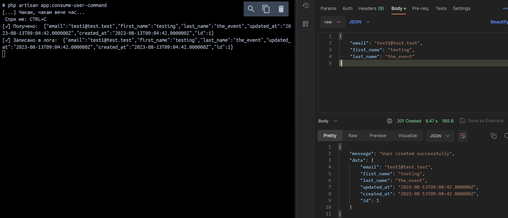

# Next Basket Interview Question - Simple implementation of a service communicating with a database and RabbitMQ

## Description

Create two microservices communicating through message bus. Code must be covered with tests and whole task must be dockerized.

#### First service

    - Must have an `POST /users` endpoint and accept a JSON payload with the following structure:

```json
{
  "email": "test@test.test",
  "first_name": "Test",
  "last_name": "Test"
}
```

    - Must store the data in a database or in a log file.
    - Must publish a message to a message bus with the same structure.

#### Second service

    - Must listen for the message published by the first service and log the message in a log file.

## Solution approach

### User microservice

1. Accepts POST requests on /users endpoint
2. Validates the request body
3. Sends requests to service which provides both connection to database and RabbitMQ.
4. A simple CQRS pattern is used to separate the write and read operations.
   - In our case only write operation is implemented.
   - A simple command bus pattern is used to handle the write operation.
5. Data is stored in a database and published to RabbitMQ.

### Notification microservice

1. Listens for messages published by the user microservice.
2. Logs the message in a log file.
3. Prints additional information to the console.

### Tests

1. 1 really simple Feature (in the context of Laravel) test is implemented for the user endpoint
2. 1 really simple Unit test is implemented for the user service

## How to run

1. Run `composer install` in both user and notification microservices.
2. Run `docker-compose up --build -d` in the root entry-point directory.
3. Inside the user microservice container run `php artisan migrate --fresh`.
4. Inside the notification microservice container run `php app:consume-user-command`.

Expected result:

